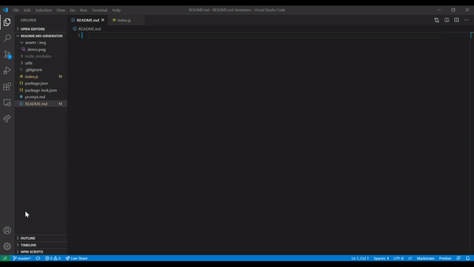
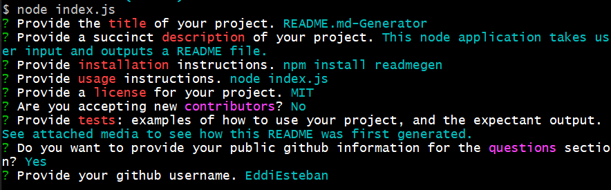

  

  

# README.md Generator

  

1. [Description](#toc-desc)

  

2. [Installation](#toc-install)

  

3. [Usage](#toc-usage)

  

4. [License](#toc-license)

  

5. [Contributing](#toc-contrib)

  

6. [Tests](#toc-tests)

  

7. [Questions](#toc-contact)

  
  
  

This node application takes user input and outputs a README file.

  

<a id='toc-install'></a>

## Installation

  

Below is an example command for installation, for a fictitious package if this repo did have a public package.

  

```sh

npm install readmegen

```

<a id='toc-usage'></a>

## Usage

  

```sh

node index.js

```

  



  

<a id=toc-license></a>

## License

  

MIT

  

<a id=toc-contrib></a>

## Contributing

  

This repository is not accepting contributors.

  

<a id='toc-tests'></a>

## Tests

  



  

See attached media to see how this README was first generated.

  

<a id='toc-contact'></a>

## Questions

  


  

Please direct any questions, concerns, and compliments to [EddiEsteban](https://github.com/EddiEsteban)